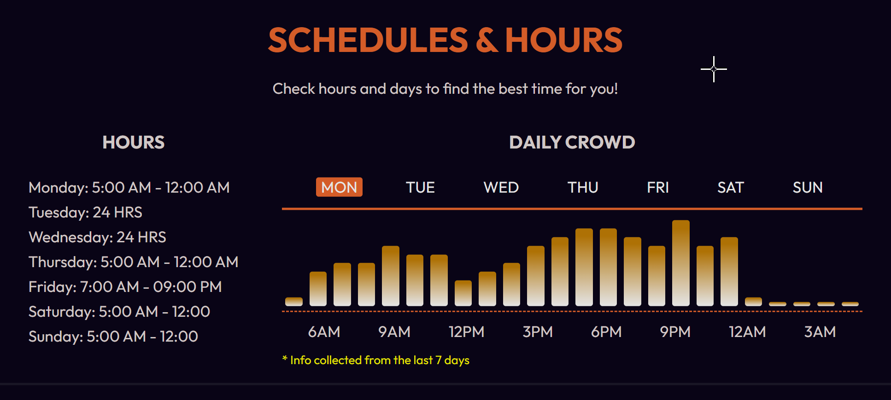

# Crowd Meter

## Design Idea

## Description

The project aims to develop an Occupancy Meter system that visualizes occupancy trends in a high-traffic location (e.g., a gym). The application will display hourly occupancy levels for each day of the week, represented as vertical bars in a graph. These bars will indicate the percentage of occupancy with color coding: green (low occupancy), yellow (medium occupancy), and red (high occupancy).

While the data is simulated to mimic real-world occupancy tracking, users will manually control the data via a RESTful API. This allows for a prototype demonstration of how such a system could work with live data in a future iteration.

### Tech Stack (In Progress)

- **Frontend**: React.js with Tailwind CSS
- **Backend**: Python with Flask or FastAPI
- **Database**: SQLite (for structured storage and easy access to data).
- **Other Tools**: Git for version control

### Planned Features

- Visual representation of hourly occupancy levels for each day of the week.
- CRUD functionality via API for manual data control.
- Responsive design for usability on various devices.
- Scalable architecture for future integration with real-time data sources (e.g., sensors).

## Current Status

🚧 Early development phase
⏳ Backend and frontend structure being defined
📋 Features and tech stack are being finalized

## Future Improvements

- Real-time Integration: Incorporate live occupancy data from sensors.
- User Notifications: Alert users when occupancy exceeds a certain threshold.
- Authentication: Restrict API access to authorized users only.
- Advanced Analytics: Add reporting features for occupancy trends and predictions.

## Credits

Developer: Luis Guaiquirian
